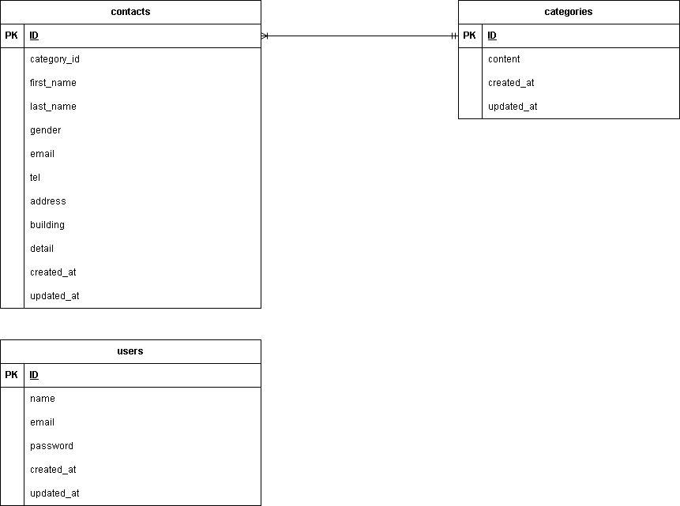

# アプリケーション名
- お問い合わせフォーム

## 環境構築
- git clone git@github.com:sophy-iu/contact-form-test-.git
- docker-compose up -d --build
- docker-compose exec php bash
- composer install
- composer require laravel/fortify
- cp .env.example .env ,環境変数を適宜変更
- php artisan make:migration create_categories_table ,カラムの追加は下記ER図参照
- php artisan make:migration create_contacts_table ,カラムの追加は下記ER図参照
- php artisan migrate

## 使用技術
- nginx（Webサーバ）
- PHP 8.1（php-fpm）
- MySQL 8.0
- phpMyAdmin

## ER図

## URL
- お問い合わせフォーム入力ページ：http://localhost/
- お問い合わせフォーム確認ページ：http://localhost/confirm
- サンクスページ：http://localhost/thanks
- 管理画面：http://localhost/admin
- 検索：http://localhost/search
- 検索リセット：http://localhost/reset
- お問い合わせフォーム削除：http://localhost/delete
- ユーザ登録：http://localhost/register
- ログイン：http://localhost/login
- ログアウト：http://localhost/logout
- エクスポート：http://localhost/export